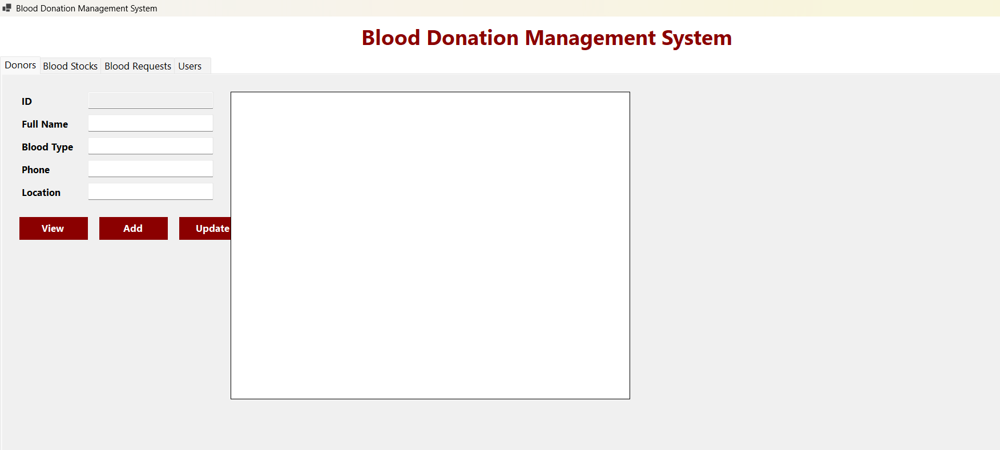
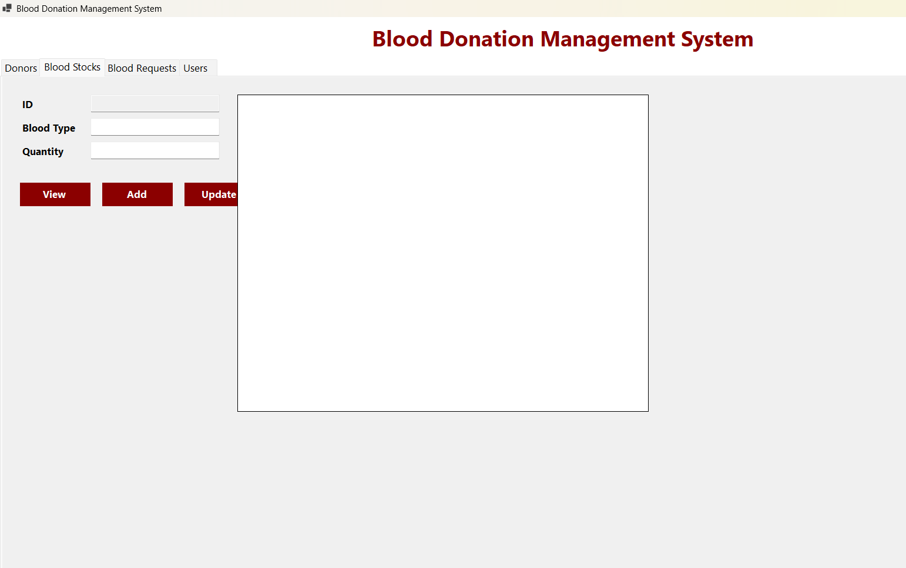
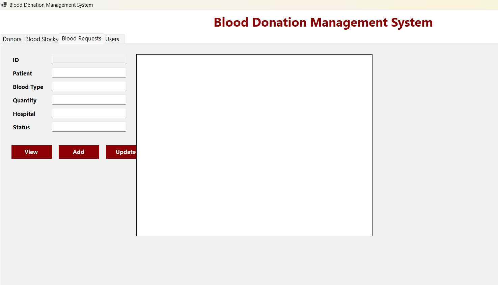
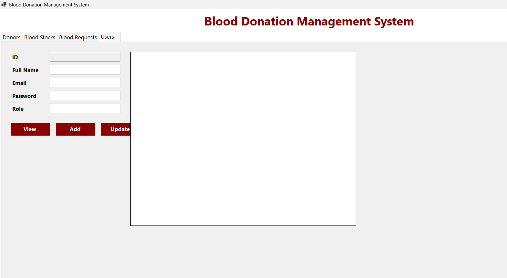

# Blood Donation Management System

A desktop blood donation management application developed using C#, Windows Forms, ASP.NET Core Web API, Entity Framework Core, and SQL Server.

The system provides a graphical interface for managing donors, blood stocks, blood requests, and application users through CRUD operations.

## Features

* Manage donor information
* Track available blood types and quantities
* Manage blood requests from patients and hospitals
* Manage system users and roles
* Add, view, and update stored records
* Connect a Windows Forms desktop interface to an ASP.NET Core Web API
* Store and retrieve data using SQL Server and Entity Framework Core

## Technologies Used

* C#
* Windows Forms
* ASP.NET Core Web API
* Entity Framework Core
* SQL Server
* REST APIs
* HttpClient
* JSON
* Visual Studio

## Project Structure

```text
Blood-Donation-Management-System/
├── BloodDonationApi/      # ASP.NET Core Web API and database logic
├── BloodDonationUI/       # Windows Forms desktop application
├── screenshots/           # Application interface screenshots
├── .gitignore
└── README.md
```

## Application Sections

### Donors

Manage donor details such as full name, blood type, phone number, and location.



### Blood Stocks

Manage available blood types and quantities.



### Blood Requests

Manage patient blood requests, including blood type, quantity, hospital, and request status.



### Users

Manage system users, login information, and user roles.



## How to Run the Project

1. Clone the repository.
2. Open the solution in Visual Studio.
3. Configure the SQL Server connection string in `appsettings.json`.
4. Apply the Entity Framework Core database migrations.
5. Run the ASP.NET Core Web API project.
6. Run the Windows Forms application.
7. Use the tabs to manage donors, blood stocks, blood requests, and users.

## Main Operations

The application supports the following operations:

* View records
* Add new records
* Update existing records
* Store and retrieve information through the Web API

## Author

**Ahmad Shaaban**

Computer Science Graduate interested in Artificial Intelligence, Machine Learning, Natural Language Processing, and Software Development.

* GitHub: [ahmadshaaban394-cell](https://github.com/ahmadshaaban394-cell)
* LinkedIn: [Ahmad Shaaban](https://www.linkedin.com/in/ahmad-shaaban-17b675259)
